|Студент      |Группа    |Вариант|
| :---------: | :------: | :---: |
|Чушников Е.О.|ЭР-05м-23 |6      |

 7. Реализовать буферный усилитель для строк (row driver). Проверить работу прибора в случае наличия проходной помехи. Предложить меры снижающие влияние проходной помехи на работу прибора. Проверить прибор на наличие эффекта памяти. Реализовать один из возможных вариантов устранения эффекта памяти.

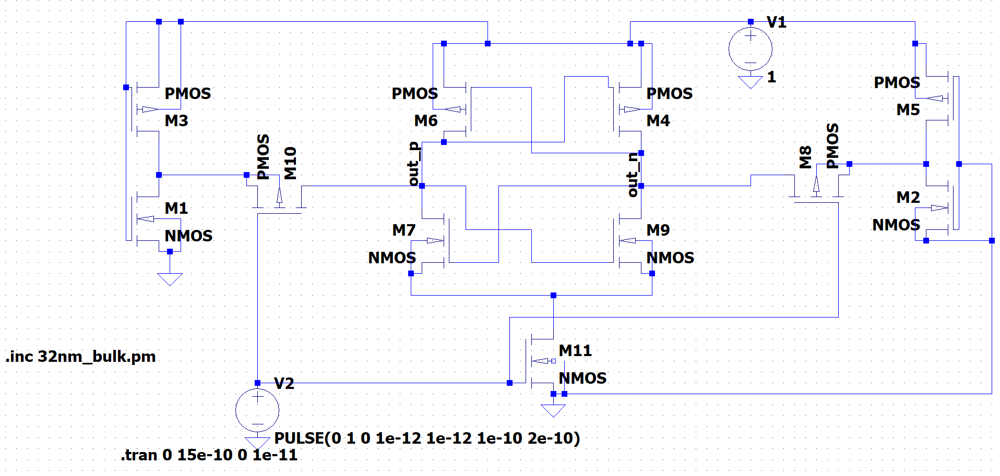

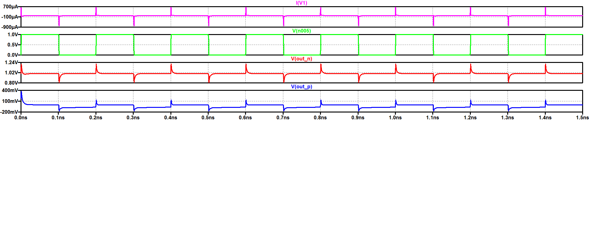

 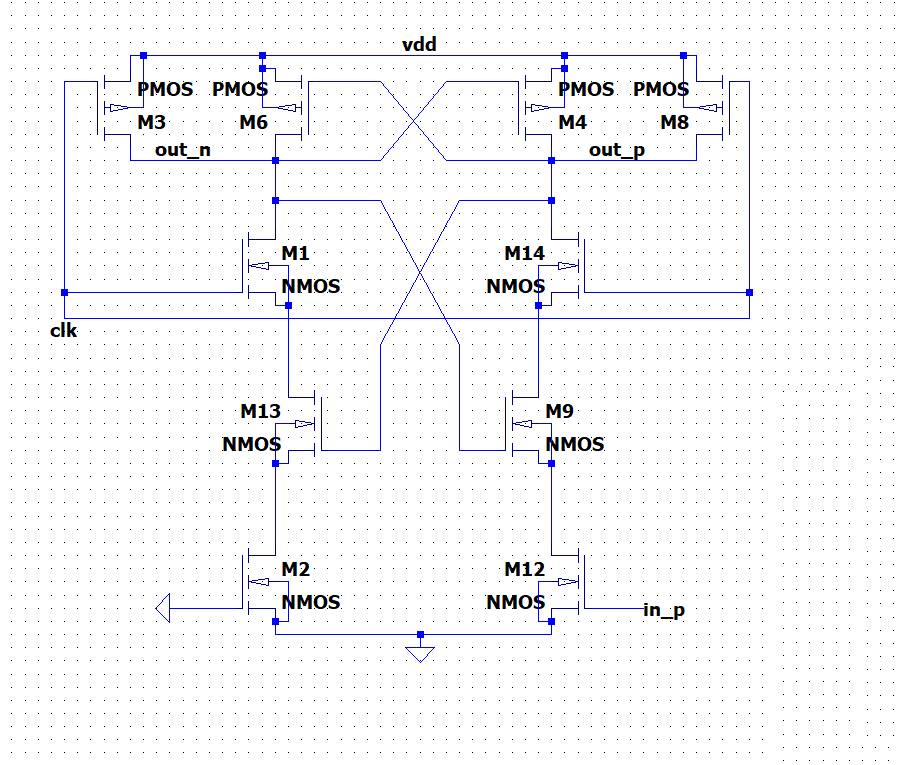

 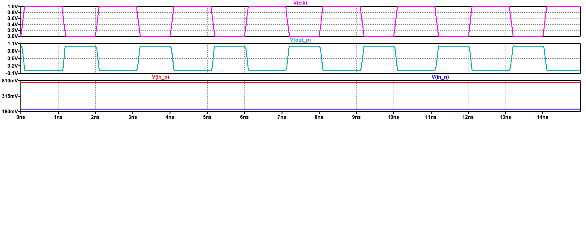

 8. Реализовать дешифратор адреса для строк. Учесть при разработке узла необходимость подведения к управляющим линиям повышенного напряжения питания.
 
 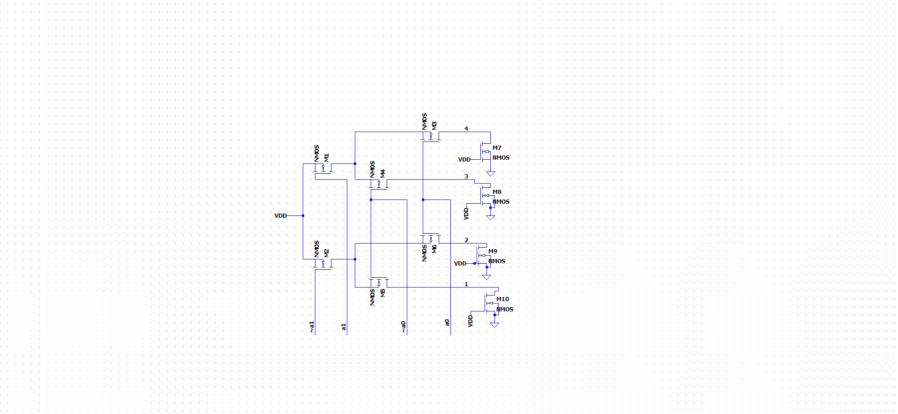

 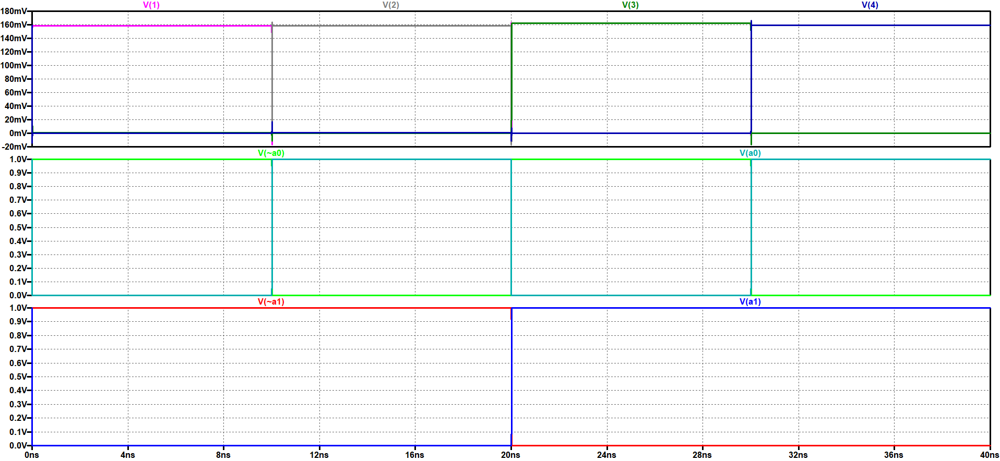

 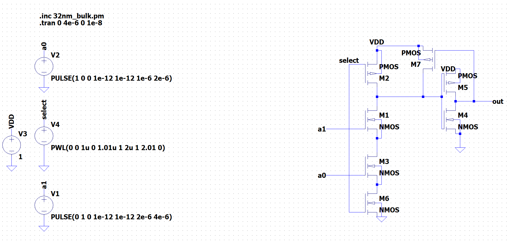

 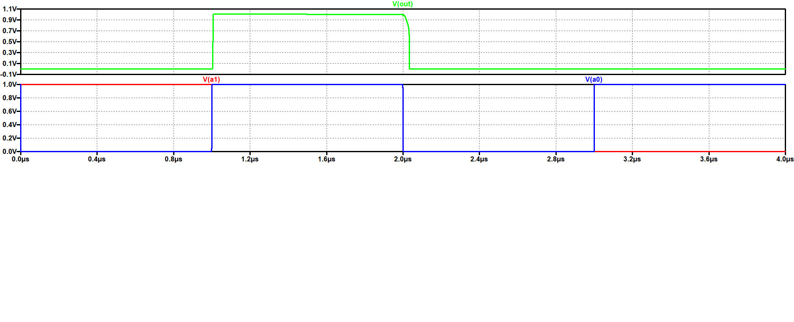

 

 9. Реализовать дешифратор адреса для столбцов. Учесть при разработке узла, что дешифратор должен поддерживать работу с линиями как в режиме записи, так и считывания.
 
 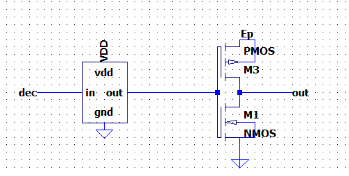

 

 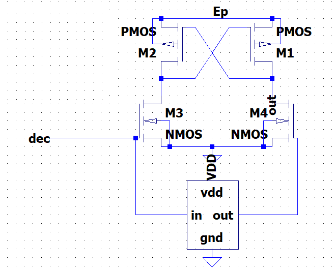

 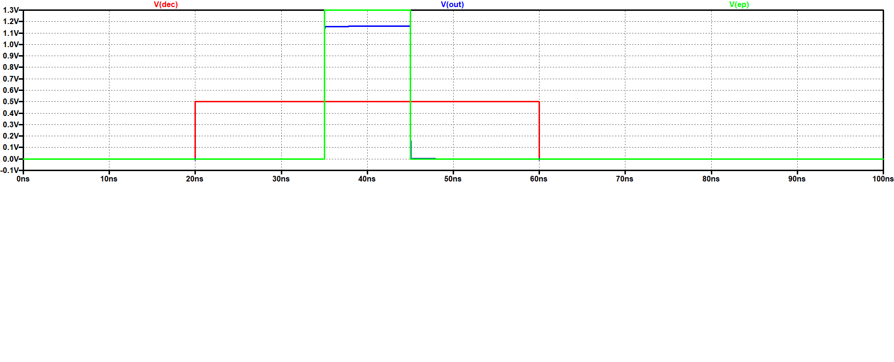

