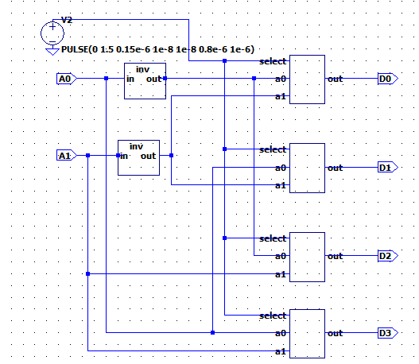
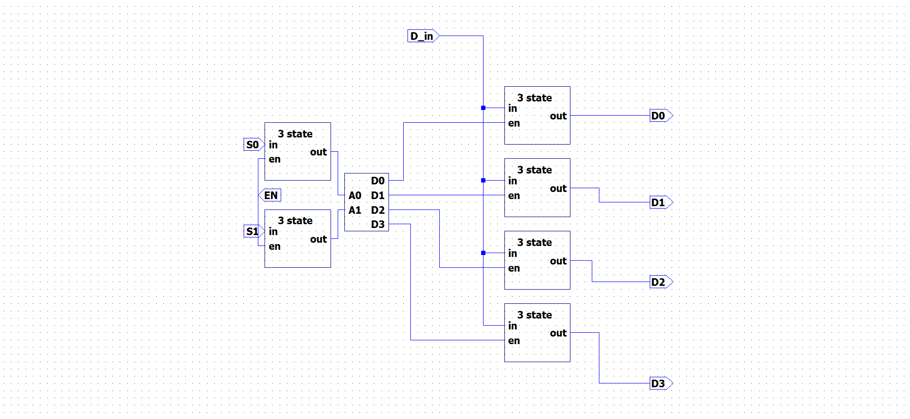
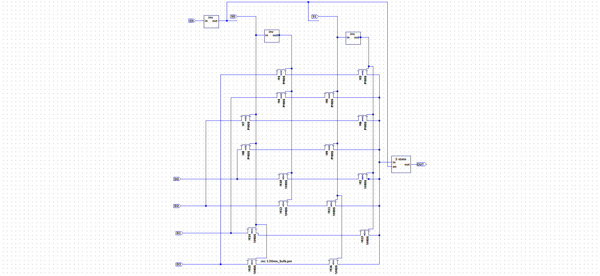
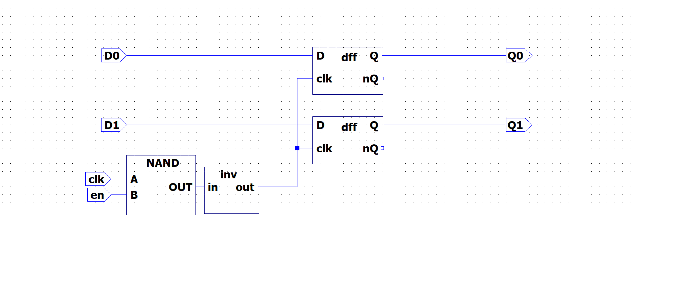
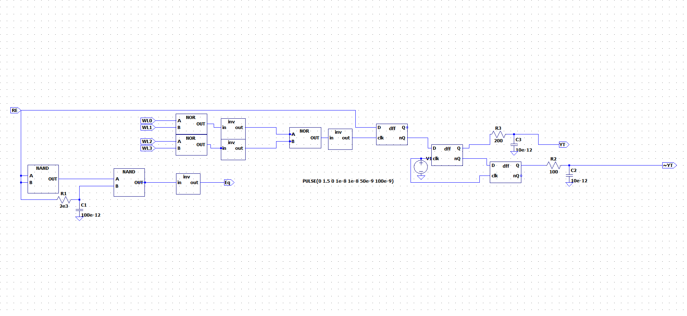
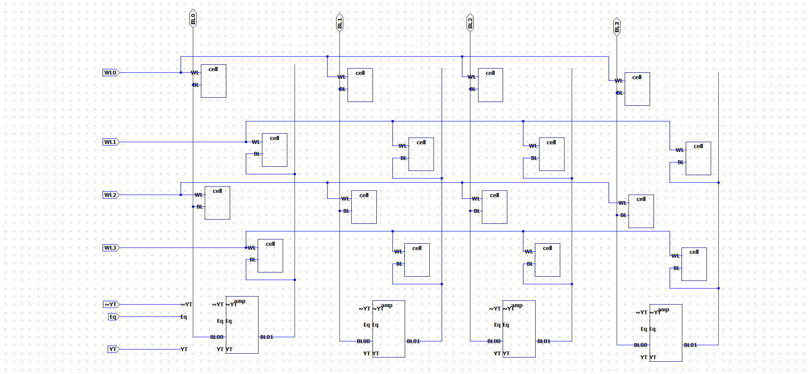
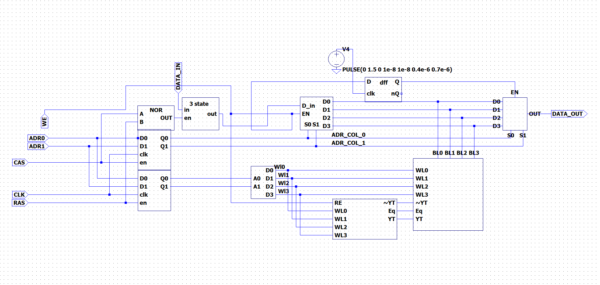
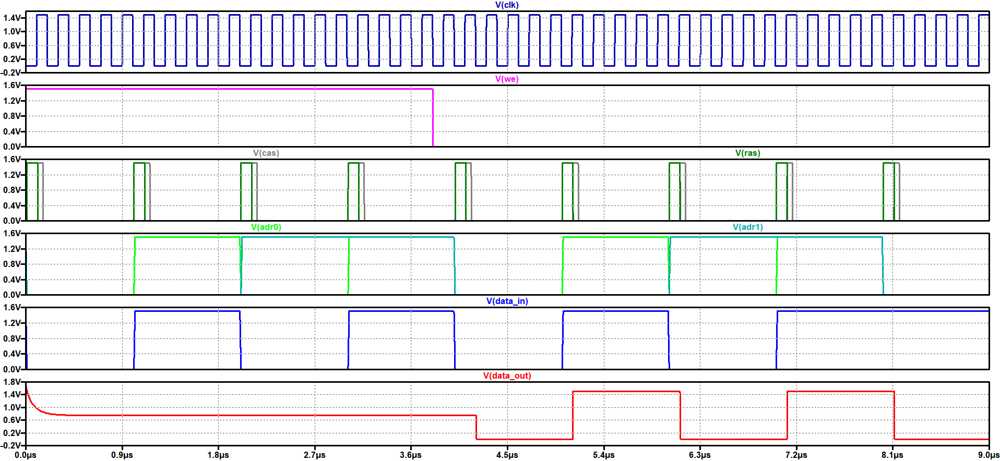

|Студент      |Группа    |Вариант|
| :---------: | :------: | :---: |
|Чушников Е.О.|ЭР-05м-23 |6      |

Рисунок 1 - Дешифратор 

Рисунок 2 - Демультиплексор 
 
Рисунок 3 - Мультиплексор 
 
Рисунок 4 - Регистр 
 
Рисунок 5 - Контролер усилителя 
 
Рисунок 6 - Закрытая архитектура матрицы памяти 
 
Рисунок 7 - Память 
 
 Рисунок 8 - Работа памяти 