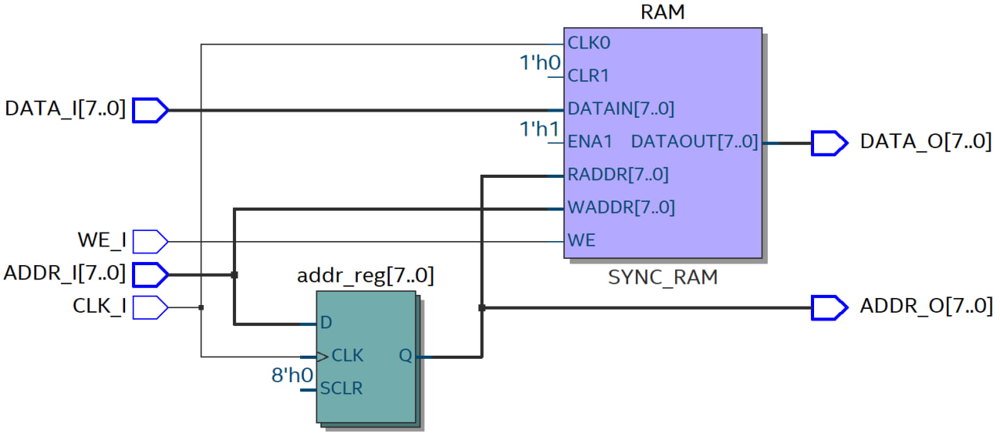
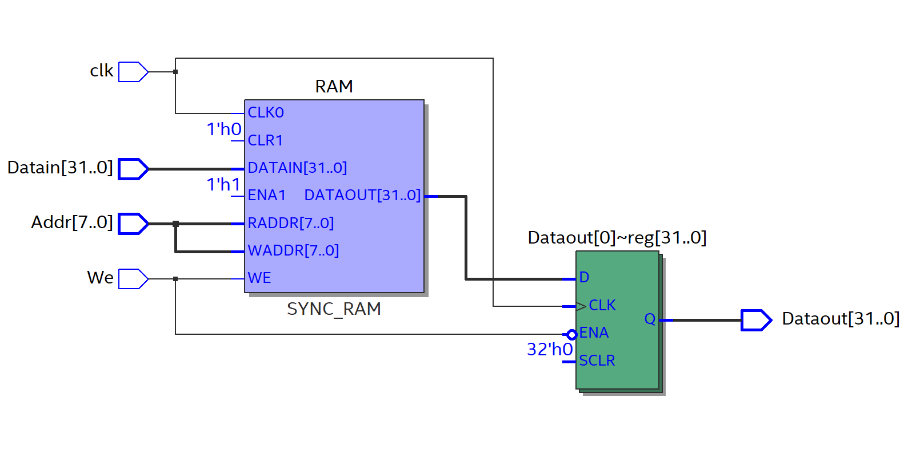
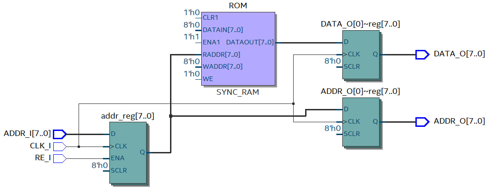
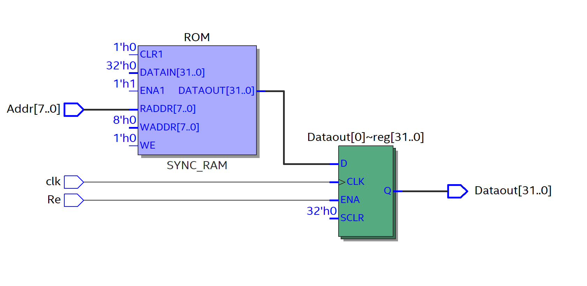
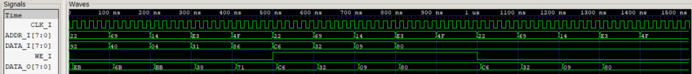
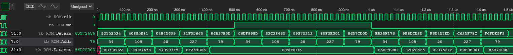
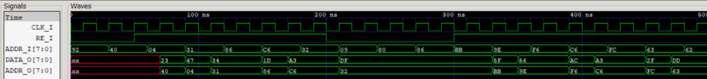
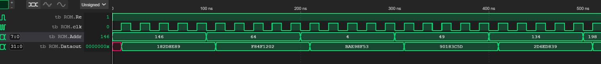

Авторы: Чушников Е.О. , Беговаткин А.А.

# КОНТРОЛЬНОЕ МЕРОПРИЯТИЕ №2 "ОДНОПОРТОВАЯ ПАМЯТЬ"

# Random Access Memory

## RAM 8x8

```systemverilog
module RAM_8x8 
#(
    parameter  DATA_WIDTH = 8,
    parameter  ADDR_WIDTH = 8
) 
(
    input   logic                               CLK_I, 
    input   logic                               WE_I, 
    input   logic [ ADDR_WIDTH - 1 : 0 ]        ADDR_I,
    input   logic [ DATA_WIDTH - 1 : 0 ]        DATA_I,
    output  logic [ DATA_WIDTH - 1 : 0 ]        DATA_O,
    output  logic [ ADDR_WIDTH - 1 : 0 ]        ADDR_O   
);

    logic [ DATA_WIDTH - 1 : 0 ] RAM [ 0 : 2**ADDR_WIDTH - 1 ];

    logic [ ADDR_WIDTH - 1 : 0 ] addr_reg;
    
    initial begin
        $readmemb("RAM_8x8.txt",RAM);
    end
 
    always_ff @(posedge CLK_I ) begin
        if (WE_I) begin
            RAM[ADDR_I] <= DATA_I;
        end
        addr_reg <= ADDR_I;
    end

    always_comb begin
        DATA_O = RAM[addr_reg];
        ADDR_O = addr_reg;
    end

endmodule
```


## RAM 32x8

```systemverilog
module RAM 
#(
    parameter  WIDTH = 32,
    parameter  DEPTH = 8
) 
(
    input   logic [ DEPTH - 1 : 0 ]          Addr,
    input   logic [ WIDTH - 1 : 0 ]          Datain,
    input   logic                            We, 
    input   logic                            clk, 
    output  logic [ WIDTH - 1 : 0 ]          Dataout   
);

    logic [WIDTH-1:0] RAM [2**DEPTH];
    
    initial begin
     $readmemb("RAM.txt",RAM);
     end
 
    always_ff @(posedge clk ) begin
        if (!We)
            Dataout <= RAM[Addr];
        else 
            RAM[Addr] <= Datain;
    end

endmodule
```


# Read Only Memory

## ROM 8x8

```systemverilog
module ROM_8x8 
#(
    parameter  DATA_WIDTH = 8,
    parameter  ADDR_WIDTH = 8	           
) 
(
    input   logic                                       RE_I,
    input   logic                                       CLK_I,
    input   logic [ ADDR_WIDTH - 1 : 0 ]                ADDR_I,
    output  logic [ DATA_WIDTH - 1 : 0 ]                DATA_O,
    output  logic [ ADDR_WIDTH - 1 : 0 ]                ADDR_O   	 
);
    
    logic [ DATA_WIDTH - 1 : 0 ] ROM [ 0 : 2**ADDR_WIDTH - 1 ];

    logic [ ADDR_WIDTH - 1 : 0 ] addr_reg; 
    
    initial begin
     $readmemb("ROM_8x8.txt",ROM);
     end
 
    always_ff @(posedge CLK_I) begin
        if (RE_I) begin
            addr_reg <= ADDR_I;
        end
		DATA_O <= ROM[addr_reg];
		ADDR_O <= addr_reg;
    end
	 
endmodule
```


## ROM 32x8

```verilog
module ROM 
#(
    parameter  WIDTH = 32,
    parameter  DEPTH = 8	           
) 
(
    input   logic [DEPTH-1:0]                Addr,
    input   logic                            Re,
    input   logic                            clk,
    output  logic [WIDTH-1:0]                Dataout   
);
    
    logic [WIDTH - 1 : 0] ROM [2**DEPTH];
    
    initial begin
     $readmemb("ROM.txt",ROM);
     end
 
    always_ff @(posedge clk ) begin
        if (Re) 
            Dataout <= ROM[Addr];
    end

endmodule
```


## Python script для заполнения массива 

```py
import random
import numpy as np

WIDTH=32
DEPTH=8
f = open('ROM.txt','w+')
for i in range(0,(2**DEPTH) ):
    v = random.randint(0, 2**WIDTH) 
    v=bin(v)[2:]
    v=str(v)
    f.writelines([v,'\n'])  
f.close()
```
## Testbenches

### RAM

```systemverilog
`include "RAM_8x8.sv"
`timescale 1 ns / 1 ns
module RAM_32x_8_tb
#(
    parameter DATA_WIDTH = 8,
    parameter ADDR_WIDTH = 8 
);

    logic                        CLK_I;
    logic                        WE_I;
    logic [ ADDR_WIDTH - 1 : 0 ] ADDR_I;
    logic [ DATA_WIDTH - 1 : 0 ] DATA_I;
    logic [ DATA_WIDTH - 1 : 0 ] DATA_O;
    logic [ ADDR_WIDTH - 1 : 0 ] ADDR_O;
    
    RAM_8x8 
    #(
        .DATA_WIDTH(DATA_WIDTH),
        .ADDR_WIDTH(ADDR_WIDTH)
    ) 
    DUT 
    (
        .ADDR_I  (  ADDR_I ),
        .CLK_I   (  CLK_I  ),
        .WE_I    (  WE_I   ),
        .DATA_I  (  DATA_I ),
        .DATA_O  (  DATA_O )
    );
    
    initial begin
        $display("Running testbench");
        CLK_I  = 0;
        WE_I   = 0;
    end

    always #10  CLK_I =  !CLK_I; 

    initial begin
        WE_I = 0;
        #500;
        WE_I = 1;
        #500;
        WE_I = 0;
        #500;
    end  

    initial begin
        for (int i = 0; i <= DATA_WIDTH; i++) begin
          DATA_I = $urandom_range(0, 2**DATA_WIDTH - 1);
          #100;                     
        end
    end

    initial begin
        ADDR_I = 34;
        #100;
        ADDR_I = 105;
        #100;
        ADDR_I = 20;
        #100;
        ADDR_I = 227;
        #100;
        ADDR_I = 79;
        #100;
         ADDR_I = 34;
        #100;
        ADDR_I = 105;
        #100;
        ADDR_I = 20;
        #100;
        ADDR_I = 227;
        #100;
        ADDR_I = 79;
        #100;
         ADDR_I = 34;
        #100;
        ADDR_I = 105;
        #100;
        ADDR_I = 20;
        #100;
        ADDR_I = 227;
        #100;
        ADDR_I = 79;
        #100;
    end  

    initial begin
        #1520 $display("Testbench is OK!");
        $finish;
    end

    initial begin
        $dumpfile("RAM_8x8.vcd");
        $dumpvars;
    end

endmodule
```
### ROM

```systemverilog
`include "ROM_8x8.sv"
`timescale 1 ns / 1 ns

module ROM_8x8_tb
#(
    parameter DATA_WIDTH = 8,
    parameter ADDR_WIDTH = 8 
);

    logic                        CLK_I; 
    logic                        RE_I;

    logic [ ADDR_WIDTH - 1 : 0 ] ADDR_I;
    logic [ DATA_WIDTH - 1 : 0 ] DATA_O;
    logic [ ADDR_WIDTH - 1 : 0 ] ADDR_O;

    ROM_8x8
    #(
        .ADDR_WIDTH(ADDR_WIDTH),
        .DATA_WIDTH(DATA_WIDTH)
    ) 
    DUT 
    (
        .ADDR_I ( ADDR_I ),
        .CLK_I  ( CLK_I  ),
        .RE_I   ( RE_I   ),
        .ADDR_O ( ADDR_O ),
        .DATA_O ( DATA_O )
    );

    initial begin
        $display("Running testbench");
        CLK_I = 0;
        RE_I  = 0;
    end

    always #10  CLK_I =  !CLK_I; 

    initial begin
        RE_I = 0;
        #50
        RE_I = 1;
        #150
        RE_I = 0;
        #100
        RE_I = 1;
    end  

    initial begin
        for (int i = 0; i <= (ADDR_WIDTH * DATA_WIDTH); i++) begin
            ADDR_I = $urandom_range(0, 2**DATA_WIDTH - 1);
            #30;                     
        end
    end

    initial begin
        #500 $display("Testbench is OK!");
        $finish;
    end

    initial begin
        $dumpfile("ROM_8x8.vcd");
        $dumpvars;
    end

endmodule
```

## Waveforms

### RAM

**RAM 8x8**



**RAM 32x8**



### ROM

**ROM 8x8**


**ROM 32x8**

