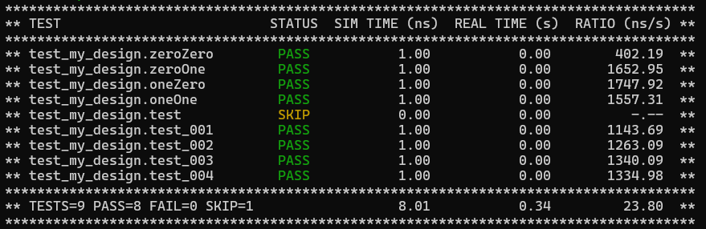
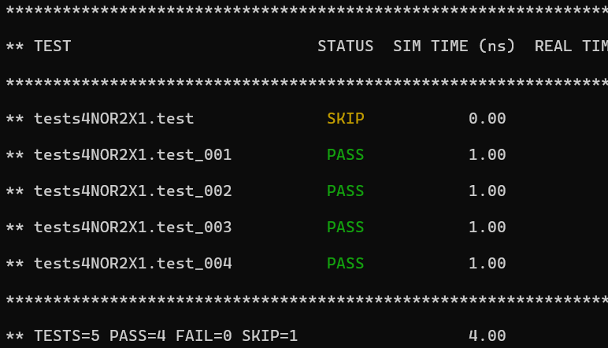

# Контрольное мероприятие #2.
## Тестирование комбинационных схем

1. Выбрать любые 5 комбинационных схем из стандартной библиотеки OSU_035 (osu035_stdcells.v в папке «КМ2 комбинационные схемы»). Провести их тестирование различным способом: с использованием поисковых таблиц в качестве модели, с использованием математической модели, с применением автоматической генерации тестовых воздействий.

### Verilog - описание модуля AND2X1:
```verilog
`timescale 1ns/10ps
`celldefine
module AND2X1 (A, B, Y);
input  A ;
input  B ;
output Y ;

   and (Y, A, B);

   specify
     // delay parameters
     specparam

       tpllh$B$Y = 0.11:0.11:0.11,
       tphhl$B$Y = 0.14:0.14:0.14,
       tpllh$A$Y = 0.11:0.11:0.11,
       tphhl$A$Y = 0.12:0.12:0.12;

     // path delays
     (A *> Y) = (tpllh$A$Y, tphhl$A$Y);
     (B *> Y) = (tpllh$B$Y, tphhl$B$Y);

   endspecify
endmodule
```

### Тестовое окружение выполненное в нескольких вариантах:
```python
import cocotb
from cocotb.triggers import Timer

################################
# Наивный вариант тестирования #
################################

@cocotb.test()
async def zeroZero(dut):
    """Реакция на 00"""
    dut.A.value = 0
    dut.B.value = 0

    #Ждем 1 нс
    await Timer(1, units="ns")
    result = dut.Y.value
    print("")
    print(f"Реакция на 00 - это {result}")
    print("")
    assert result == 0, "Результат не 0!"

@cocotb.test()
async def zeroOne(dut):
    """Реакция на 01"""
    dut.A.value = 0
    dut.B.value = 1

    #Ждем 1 нс
    await Timer(1, units="ns")
    result = dut.Y.value
    print("")
    print(f"Реакция на 01 - это {result}")
    print("")
    assert result == 0, "Результат не 0!"

@cocotb.test()
async def oneZero(dut):
    """Реакция на 10"""
    dut.A.value = 1
    dut.B.value = 0

    #Ждем 1 нс
    await Timer(1, units="ns")
    result = dut.Y.value
    print("")
    print(f"Реакция на 10 - это {result}")
    print("")
    assert result == 0, "Результат не 0!"

@cocotb.test()
async def oneOne(dut):
    """Реакция на 11"""
    dut.A.value = 1
    dut.B.value = 1

    #Ждем 1 нс
    await Timer(1, units="ns")
    result = dut.Y.value
    print("")
    print(f"Реакция на 11 - это {result}")
    print("")
    assert result == 1, "Результат не 1!"

######################################################
# Вариант тестирования с поисковой таблицей и циклом #
######################################################
    
def model(data):
    lookupTable = {0b00:0,
                   0b01:0,
                   0b10:0,
                   0b11:1}
    
    Y = lookupTable[data]
    return Y

def getBinDigit(num,n):
    mask = 1 << n
    maskedNum = num & mask
    binDigit = maskedNum >> n
    return binDigit

@cocotb.test()
async def test(dut):
    numberOfInputs = 2
    for num in range(2**numberOfInputs):
        dut.A.value = getBinDigit(num,0)
        dut.B.value = getBinDigit(num,1)

        await Timer(1, units="ns")
        result = dut.Y.value
        print("")
        print(f"Реакция на {dut.A.value}{dut.B.value} - это {result}")
        print("")
        trueResult = model(num)
        assert result == trueResult, f"Результат не {trueResult}"

######################################################
# Вариант тестирования с фабрикой                    #
######################################################
        
from cocotb.regression import TestFactory

def model(A, B):
    Y = A & B
    return Y

@cocotb.test(skip=True)
async def test(dut, A, B):
    dut.A.value = A
    dut.B.value = B

    await Timer(1, units="ns")
    result = dut.Y.value
    print("")
    print(f"Реакция на {dut.A.value}{dut.B.value} - это {result}")
    print("")
    trueResult = model(A, B)
    assert result == trueResult, f"Результат не {trueResult}"

tf = TestFactory(test_function=test)
tf.add_option(name='A', optionlist=[0, 1])
tf.add_option(name='B', optionlist=[0, 1])
tf.generate_tests()
```



### Verilog-описание модуля NOR2x1

```verilog
`timescale 1ns/10ps
`celldefine
module NOR2X1 (A, B, Y);
input  A ;
input  B ;
output Y ;

   or  (I0_out, A, B);
   not (Y, I0_out);

   specify
     // delay parameters
     specparam
       tplhl$B$Y = 0.07:0.07:0.07,
       tphlh$B$Y = 0.063:0.063:0.063,
       tplhl$A$Y = 0.094:0.094:0.094,
       tphlh$A$Y = 0.075:0.075:0.075;

     // path delays
     (A *> Y) = (tphlh$A$Y, tplhl$A$Y);
     (B *> Y) = (tphlh$B$Y, tplhl$B$Y);

   endspecify

endmodule
`endcelldefine
```

### Проверка работы производится с помощью сравнения с эталонной моделью

```python
import cocotb
from cocotb.triggers import Timer

######################################################
# Вариант тестирования с фабрикой                    #
######################################################
        
from cocotb.regression import TestFactory
    
def model(A, B):
    Y = not(A or B)
    return Y

@cocotb.test(skip=True)
async def test(dut, A, B):
    dut.A.value = A
    dut.B.value = B

    await Timer(1, units="ns")
    result = dut.Y.value
    print("")
    print(f"Реакция на {dut.A.value}{dut.B.value} - это {result}")
    print("")
    trueResult  = model(A, B) 
    assert result == trueResult, f"Результат не {trueResult}"

tf = TestFactory(test_function=test)
tf.add_option(name='A', optionlist=[0, 1])
tf.add_option(name='B', optionlist=[0, 1])
tf.generate_tests()
```


### Verilog-описание модуля OAI21X1
```verilog
`timescale 1ns/10ps
`celldefine
module OAI21X1 (A, B, C, Y);
input  A ;
input  B ;
input  C ;
output Y ;

   or  (I0_out, A, B);
   and (I1_out, I0_out, C);
   not (Y, I1_out);

   specify
     // delay parameters
     specparam
       tplhl$A$Y = 0.087:0.087:0.087,
       tphlh$A$Y = 0.098:0.098:0.098,
       tplhl$B$Y = 0.064:0.064:0.064,
       tphlh$B$Y = 0.09:0.09:0.09,
       tplhl$C$Y = 0.046:0.062:0.079,
       tphlh$C$Y = 0.07:0.076:0.081;

     // path delays
     (A *> Y) = (tphlh$A$Y, tplhl$A$Y);
     (B *> Y) = (tphlh$B$Y, tplhl$B$Y);
     (C *> Y) = (tphlh$C$Y, tplhl$C$Y);

   endspecify

endmodule
`endcelldefine
```

